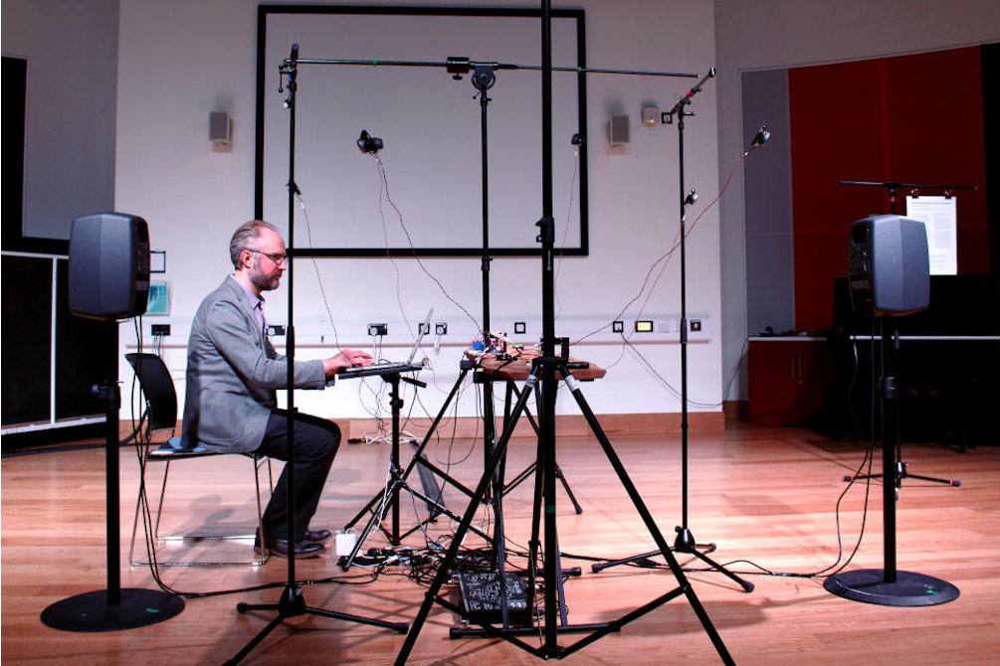
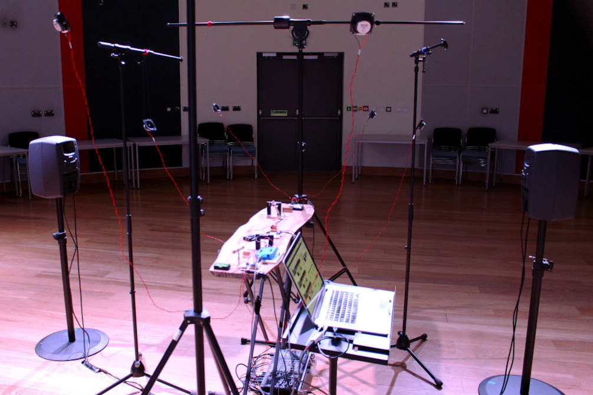

# On the Production of True Consonance  

  

_**On the Production of True Consonance**_ (2016) is an 8-channel sound installation for automated monochord, loudspeakers and MaxMSP. Six tiny loudspeakers are suspended in a hexagonal formation above an elm wood monochord.  

  

The work is based on a letter from the sixteenth-century mathematician, Giovanni Battista Benedetti to the composer, Cipriano de Rore, in which Benedetti demonstrates a phenomenon of pitch drift in choral singing. 

On the Production of True Consonance was first shown on 23 April 2016, as part of a group concert-event in Cambridge, England, which also featured work by Richard Hoadley, Tom Hall and Fredrik Olofsson.  

