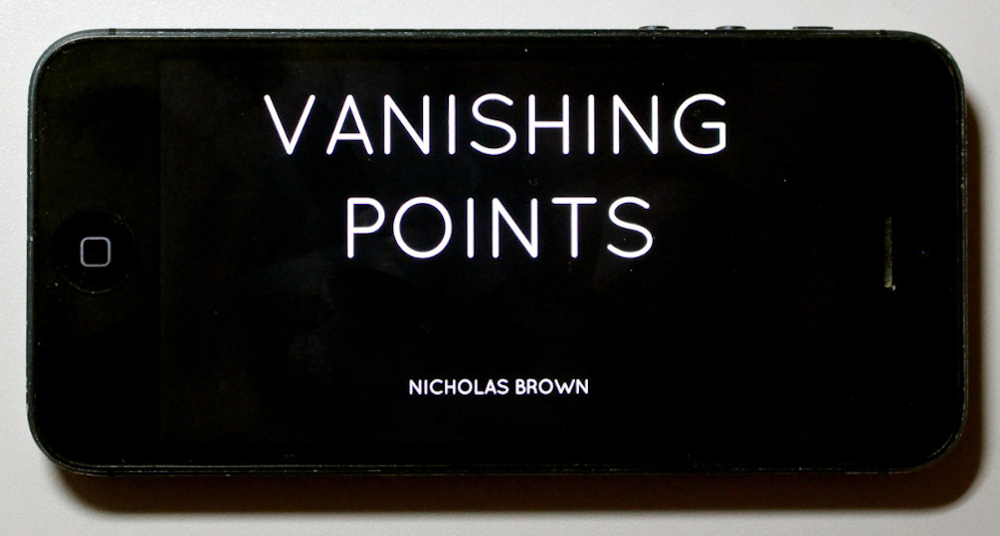
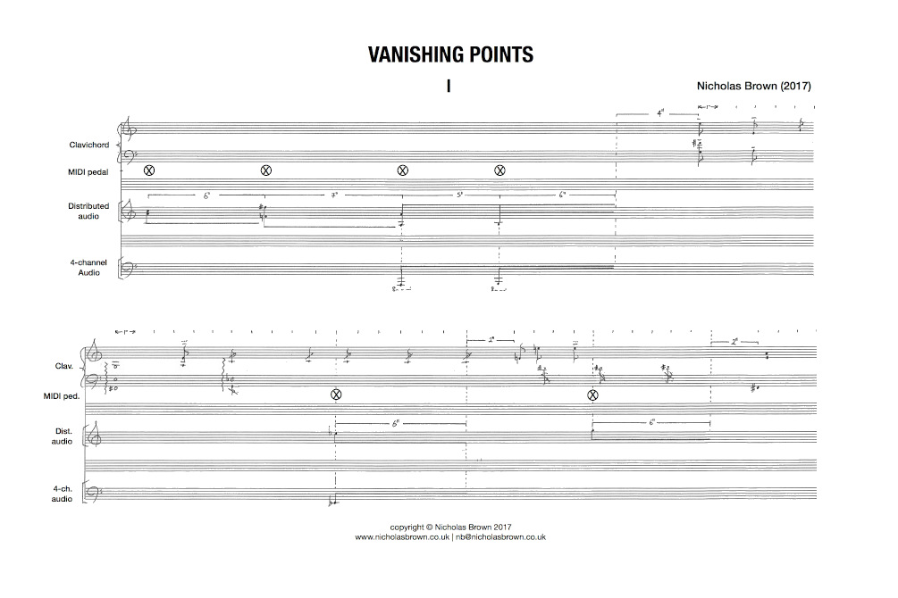

# Vanishing Points

In 1781, C.P.E. Bach sold his Silbermann clavichord to Dietrich Ewald von Grotthuss. To mark the sale, Bach wrote a ‘farewell’ rondo, *Abschied von meinem Silbermannischen Claviere*. This work makes extensive use of 'bebung', an expressive feature of the clavichord that allows the player to vary the pitch of a note by varying the pressure of a finger on a key. Bebung is thus a curative method of prolongation - a way of modulating the bloom and decay of a tone.

  

_**Vanishing Points**_ (2017) is based on an analysis of Bach’s *Abschied*. Certain sounds are distributed through the mobile devices of audience members, using web audio technology [IRCAM/CoSiMa Nü Soundworks](https://ircam-cosima.github.io/soundworks-nu/). This transition from the domain of fixed loudspeakers to mobile devices makes another kind of bebung, marked by a change in frequency response and accordingly, by the modulation of electronic sound as it is distributed to individual listening spaces.  

_**Vanishing Points**_ was first performed at the [Orpheus Institute](http://www.orpheusinstituut.be), Ghent as part of the inaugural Open Circuit event of live sound art. The work was subsequently performed at [Sonorities Festival](https://www.sonorities.org), Belfast in April, 2018. 

