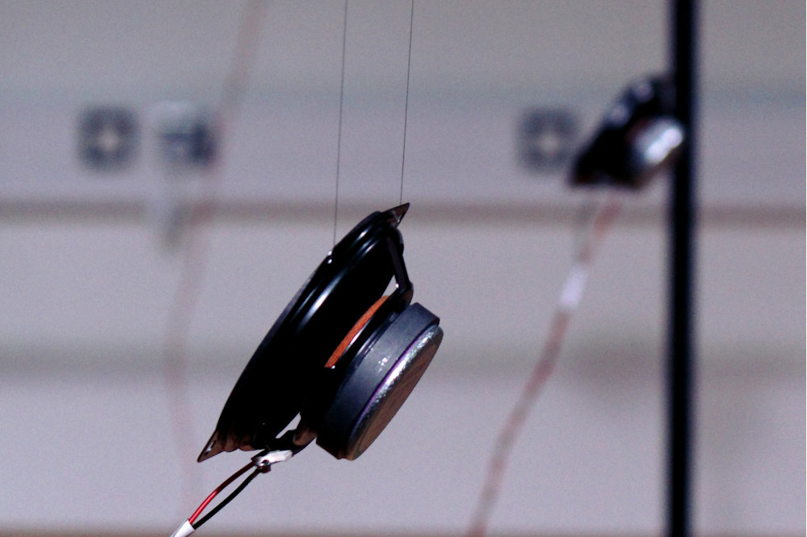
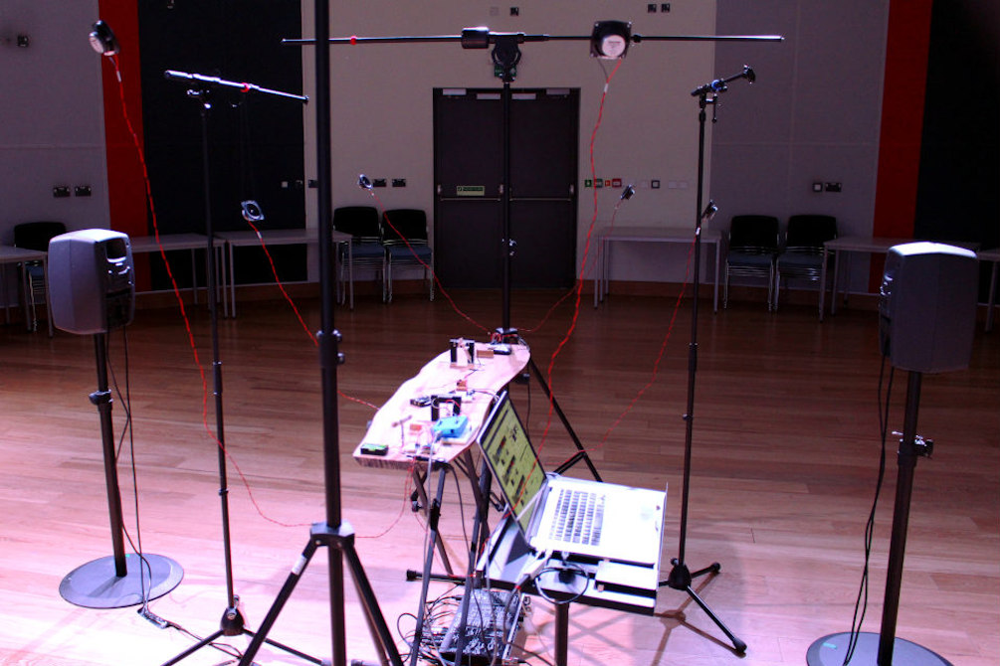

# On the Production of True Consonance

_**On the Production of True Consonance**_ (2016) is an 8-channel sound installation for automated monochord, loudspeakers and MaxMSP. Six tiny loudspeakers are suspended in a hexagonal formation above an elm wood monochord.

  
The work is based on a letter from the sixteenth-century mathematician, Giovanni Battista Benedetti to the composer, Cipriano de Rore, in which Benedetti demonstrates a phenomenon of pitch drift in choral singing.

**On the Production of True Consonance** was first shown on 23 April 2016, at Anglia Ruskin University, Cambridge, England as part of a group show which also featured work by [Richard Hoadley](https://rhoadley.net), [Tom Hall](https://www.ludions.com) and [Fredrik Olofsson](https://www.fredrikolofsson.com/).
  

  
