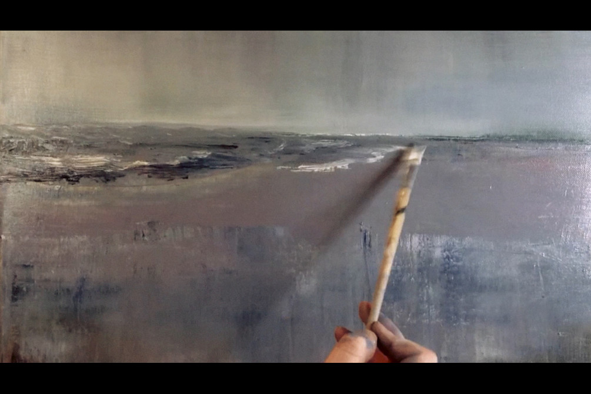

# Starfish

_**Starfish**_ (2016) is a song for high voice, piano and live electronics with accompanying time-lapse video by [F.C. Heathorn](https://fcheathorn.com/). It is a 2016 reworking of a song/haiku I wrote in 2010 about finding a four-armed starfish on Holkham Beach, Norfolk, England in winter.
  

  
The song was reworked by expanding the vocal line and developing the accompaniment for piano and electronics. Cut-up fragments from the original text are delivered by the tenor voice as if washed ashore with the sea foam:

 Relics of the sea, Dark viridian woodland. Blanched red glow of sand.

  
*Starfish* marks the second of my collaborations with the artist, [F.C. Heathorn](https://www.fcheathorn.com), following my sound installation based on regional field recordings for her 2015 show of oil paintings (In Arcady, Yallops Gallery, Norwich). It was first performed by James Geer (tenor) and Nicholas Brown (piano) at the Mumford Theatre, Cambridge in Feburary 2016.
