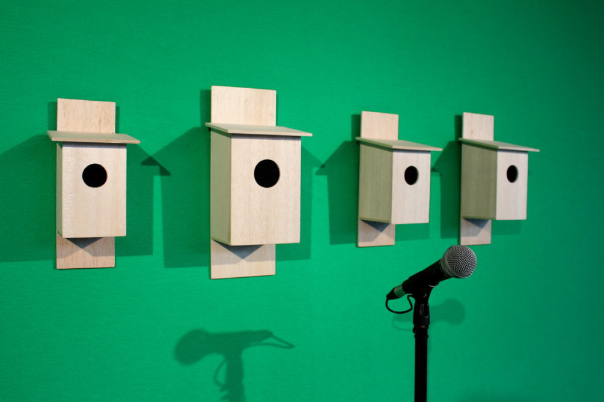
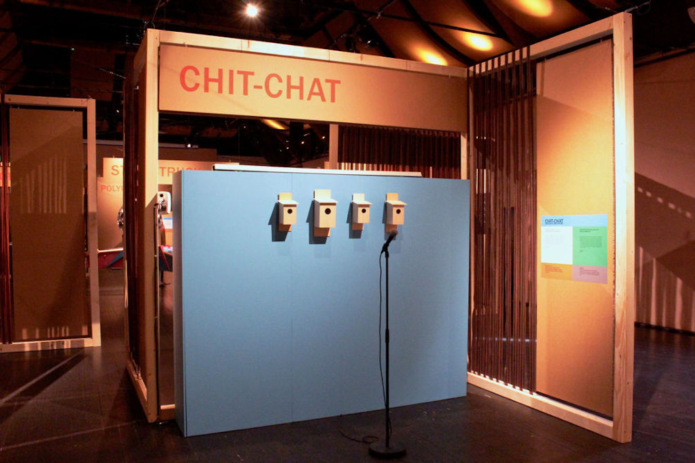
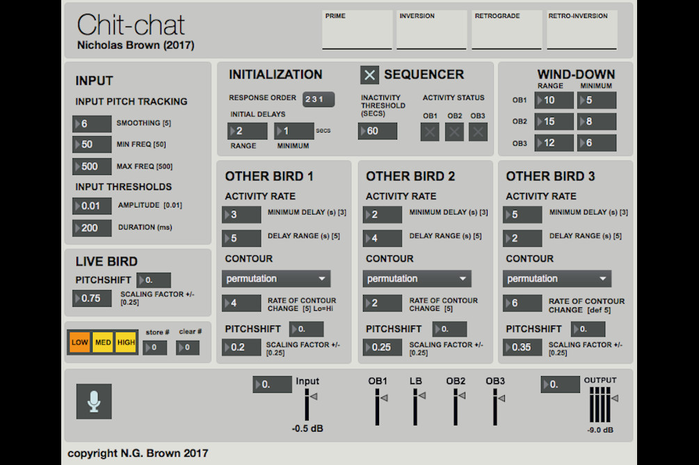

# Chit-chat 

_**Chit-chat**_ (2017) is an interactive sound installation that transforms a human vocalization into birdsong. When a participant speaks or sings into a microphone, their voice is transformed into a bird-call.
  

  
The sound of the bird-call is determined by the musical characteristics (pitch variation, loudness) of whatever the participant says or sings into the mic. This bird-call triggers further calls from the other bird-boxes, which are also shaped by the original vocalization. The result is a musical ‘conversation’ with a flock of ‘birds’. 
  

  
The installation was built with [Max7](http://www.cycling74.com) software, with additional use of IRCAM's [FTM & Co](http://ftm.ircam.fr/index.php/Main_Page) library:
  

  
*Chit-chat* is the third work in Nicholas Brown’s ongoing series of bird-box installations, following *An Audience with the Trees* (2005) and *Bird Chamber* (2009). It originally featured in [SOUND CHECK](https://dublin.sciencegallery.com/soundcheck/), Science Gallery, Dublin's summer exhibition, June 9 - Sept 24, 2017. The installation is currently on show at the [Scenkonstmuseet](https://scenkonstmuseet.se/artikel/snart-slar-sound-check-upp-portarna/), Stockholm, where Sound Check is on tour until August 18, 2019.
<iframe src="https://www.facebook.com/plugins/video.php?href=https%3A%2F%2Fwww.facebook.com%2Fscenkonstmuseet%2Fvideos%2F436160813887780%2F&show_text=false&width=734&appId=250686088293082&height=411" width="734" height="411" style="border:none;overflow:hidden" scrolling="no" frameborder="0" allowTransparency="true" allow="encrypted-media" allowFullScreen="true"></iframe>

