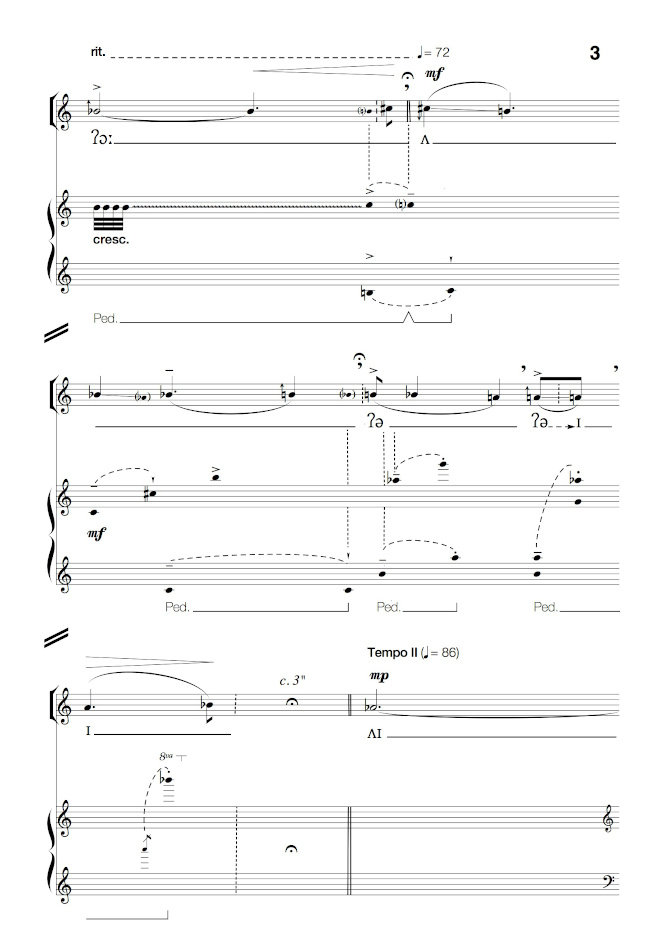

# Structural Cohesion

_**Structural Cohesion**_ (2019) concerns the function of rhetoric across diverse forms of human activity, from impassioned speech to the history of opera. It was originally designed for performance in the spaces of Concertgebouw, Brugge. During the first performance, in November 2019, electroacoustic, vocal and choral performances were spatially distributed throughout the building.

 

The work was partly devised as an educational project. The first performance included the culmination of a vocal workshop (led by Natasha Lohan) for voice students from the Royal Conservatoire Antwerp.

The work uses a text drawn from *Lectures on Rhetoric and Belles Lettres* (1783) by the eighteenth-century rhetorician, Hugh Blair, which cautions against unqualified persuasive discourse:

  > The first care of all such as wish either to write with reputation, or to speak in public so as to command attention, must be, to extend their knowledge’.

 

Much of the musical material is derived from a computer analysis of this line of text being spoken. This constitutes the basis of the ‘Rhetorical Song’, which was presented in the lobby (Inkomhal) of the building in tandem with simultaneous vocal activity in the Foyer parterre.

The choral performance made its way through the building’s informal spaces, functioning as a kind of transition between the expressivity of the Rhetorical Song, performed on the ground floor, and the algorithmic game-song performed by the two principal singers (Maribeth Diggle, Natasha Lohan) on the first floor (Foyer parterre).

**Structural Cohesion** was first presented on November 21, 2019 at [Concertgebouw Brugge](https://www.concertgebouw.be), Brugge, Belgium in association with Orpheus Institute, Ghent and Royal Conservatoire Antwerp.
